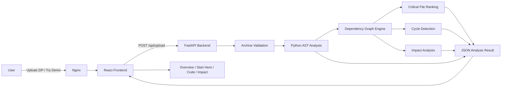

# RepoLens

> **Understand first. Change with confidence.**

RepoLens is a **repository intelligence platform** for understanding unfamiliar codebases before making changes.

Upload a repository ZIP and RepoLens turns the project into a structured, visual model: repository tree, Python AST intelligence, dependency relationships, critical-file ranking, circular-dependency checks, onboarding guidance, and change-impact analysis.

RepoLens is designed around a simple question:

> **If I change this file, what else could be affected?**

---

## ✨ Highlights

| Capability | What RepoLens does |
| --- | --- |
| **Repository inspection** | Builds a navigable representation of the uploaded codebase |
| **Python AST analysis** | Detects functions, async functions, classes, imports, and parse failures |
| **Dependency graph** | Maps import relationships between source files |
| **Impact analysis** | Estimates the transitive blast radius of changing a file |
| **Critical-file ranking** | Surfaces modules with higher architectural influence |
| **Cycle detection** | Detects circular dependencies in the dependency graph |
| **Start Here mode** | Suggests a practical reading order for newcomers to the codebase |
| **Interactive graph** | Lets users focus on a file and inspect related dependencies visually |
| **Demo mode** | Shows RepoLens without requiring users to prepare a ZIP first |
| **Multilingual UI** | English, Uzbek, German, and Russian |
| **Theme system** | Dark, light, and system themes |
| **Security-focused upload pipeline** | Validates archives and analyzes code without executing uploaded repository code |

---

## 🎯 Why RepoLens?

Opening an unfamiliar repository usually means jumping between directories, searching imports manually, finding entry points, and trying to guess which files are safe to modify.

RepoLens reduces that first-pass exploration work by helping answer questions such as:

- Where does the application appear to start?
- Which source files depend on each other?
- What functions and classes exist in a Python module?
- Which files influence the most other files?
- Are there circular dependencies?
- What could be affected if a particular module changes?
- Which files should a new developer read first?

---

## 🧠 Core Analysis

### Repository Structure

RepoLens converts archive paths into a navigable file tree and filters common dependency, build, cache, and virtual-environment directories such as:

```text
.git/
.venv/
venv/
node_modules/
__pycache__/
dist/
build/
```

### Python AST Intelligence

Python source is parsed with Python's **Abstract Syntax Tree (AST)** instead of relying on regular-expression matching.

For each supported Python file, RepoLens can identify:

- functions
- async functions
- classes
- imports
- syntax / parse failures
- source encoding and analyzed file size

Uploaded repository code is **parsed, not executed**.

### Dependency Mapping

RepoLens converts import relationships into a directed graph.

```text
main.py ─────→ auth.py
   │             │
   │             └────→ database.py
   └──────────→ api.py
```

The frontend renders this structure as an interactive architecture graph so relationships can be explored visually.

### Change Impact / Blast Radius

RepoLens computes transitive dependents for a selected source file.

For example:

```text
auth.py changes
      ↓
main.py
users.py
api.py
```

The impact view combines affected files with a simple risk level to make architectural consequences easier to inspect before editing code.

### Critical Files

Files are ranked using dependency-graph signals such as direct dependents and total downstream impact.

This helps surface files that deserve extra attention before modification.

### Circular Dependency Detection

RepoLens checks the dependency graph for cycles and reports architectural warnings when circular relationships are found.

### Start Here Mode

The onboarding view helps a developer approach an unfamiliar repository in a more useful order.

It prioritizes likely entry points, influential files, and modules with meaningful downstream impact, then presents a suggested reading path.

---

## 🏗️ Architecture



### Request flow

1. The user uploads a `.zip` repository or starts the built-in demo.
2. Nginx serves the React application and proxies `/api/` requests to FastAPI.
3. The backend validates the archive before analyzing source files.
4. Python source is parsed with AST.
5. RepoLens builds the dependency graph and derives critical files, cycles, and impact information.
6. The frontend renders the analysis as dashboards and interactive visualizations.

---

## 🛡️ Security Model

RepoLens treats every uploaded archive as **untrusted input**.

Current safeguards include:

- `.zip`-only upload validation
- compressed upload size limit
- maximum ZIP member count
- maximum retained uncompressed size
- path-traversal rejection (`../`, absolute paths, suspicious drive-style paths)
- duplicate archive-path rejection
- suspicious compression-ratio checks
- per-Python-file analysis size limit
- malformed source isolation
- encrypted / unsafe ZIP member rejection in the hardened pipeline
- filtering of dependency, cache, build, and virtual-environment directories
- request / analysis time budgeting
- Nginx request-body limits
- API rate limiting
- security headers and CSP at the reverse proxy
- container CPU, memory, and process limits
- `no-new-privileges`
- backend and frontend containers configured to run as non-root users
- uploaded repository code is never intentionally executed

Default application limits are configurable through environment variables. Current defaults include a **25 MiB compressed upload limit**, **10,000 ZIP members**, **100 MiB retained uncompressed content**, and **2 MiB per analyzed Python file**.

> RepoLens reduces risk through layered controls; it does not claim that any public web application can be made perfectly secure.

---

## 🧰 Tech Stack

### Frontend

- React
- Vite
- CSS
- SVG-based dependency visualization
- Nginx

### Backend

- Python
- FastAPI
- Python `ast`
- ZIP archive inspection
- custom dependency-graph analysis

### Infrastructure & Quality

- Docker
- Docker Compose
- Pytest
- GitHub Actions CI
- non-root containers

---

## 🚀 Run Locally

### Requirements

Install:

- Docker
- Docker Compose v2
- Git

### Clone

```bash
git clone https://github.com/asadbekabduvahobovvvv-glitch/RepoLens.git
cd RepoLens
```

### Start RepoLens

```bash
sudo docker compose up -d --build
```

Open:

```text
http://localhost:8080
```

### Stop

```bash
sudo docker compose down
```

---

## 🧪 Tests

Run the backend test suite from the repository root:

```bash
cd backend
python -m pytest -q
```

The test suite covers core analysis behavior as well as security-focused archive validation cases.

---

## 🖥️ Product Experience

RepoLens currently includes four primary analysis views:

### Overview

Repository tree, language distribution, dependency graph, security posture, and top-level metrics.

### Start Here

A newcomer-oriented reading path that highlights entry points and influential modules.

### Code Intelligence

Per-file Python AST information including functions, classes, and imports.

### Impact Analysis

Change-risk level, critical-file ranking, cycle status, and affected downstream files.

The interface also includes:

- **Try Demo** mode
- interactive graph highlighting
- impact animations
- dark / light / system themes
- English / Uzbek / German / Russian UI

---

## 📸 Screenshots

> Screenshots will be added before the public release.

Suggested final set:

1. Landing page / upload flow
2. Overview dashboard
3. Interactive dependency graph
4. Start Here onboarding mode
5. Code Intelligence
6. Impact Analysis
7. Dark and light themes

---

## 📁 Project Structure

```text
RepoLens/
├── backend/
│   ├── app/
│   │   ├── main.py
│   │   └── graph_analysis.py
│   ├── tests/
│   └── Dockerfile
├── frontend/
│   ├── public/
│   ├── src/
│   │   ├── App.jsx
│   │   ├── App.css
│   │   ├── i18n.js
│   │   ├── onboarding.css
│   │   └── theme.css
│   ├── nginx.conf
│   └── Dockerfile
├── .github/
│   └── workflows/
├── docker-compose.yml
├── LICENSE
└── README.md
```

---

## ⚠️ Current Limitations

RepoLens is an actively developed portfolio project. Current analysis has deliberate scope limits:

- deep semantic analysis is strongest for Python
- dependency inference is based primarily on import relationships
- dynamic imports and runtime-generated dependencies may not be visible statically
- impact analysis is architectural estimation, not a guarantee that a change will break or preserve behavior
- repositories are analyzed as uploaded snapshots rather than directly from Git hosting providers

These constraints are documented intentionally so RepoLens does not overstate what static analysis can determine.

---

## 🗺️ Roadmap

Planned directions include:

- richer multi-language static analysis
- improved dependency-graph interaction
- repository comparison / change-diff intelligence
- "Before You Edit" recommendations
- exportable analysis reports
- deeper architecture scoring
- public hosted demo

---

## 💡 Project Goal

RepoLens is not intended to replace IDEs, linters, or full static-analysis platforms.

Its goal is to provide a **fast architectural orientation layer** between opening an unfamiliar repository and beginning to modify it.

> **Understand first. Change with confidence.**

---

## 👤 Author

Built by **Asadbek**.

- GitHub: [asadbekabduvahobovvvv-glitch](https://github.com/asadbekabduvahobovvvv-glitch)
- Repository: [RepoLens](https://github.com/asadbekabduvahobovvvv-glitch/RepoLens)

---

## 📄 License

This project is licensed under the **MIT License**. See [`LICENSE`](LICENSE) for details.
